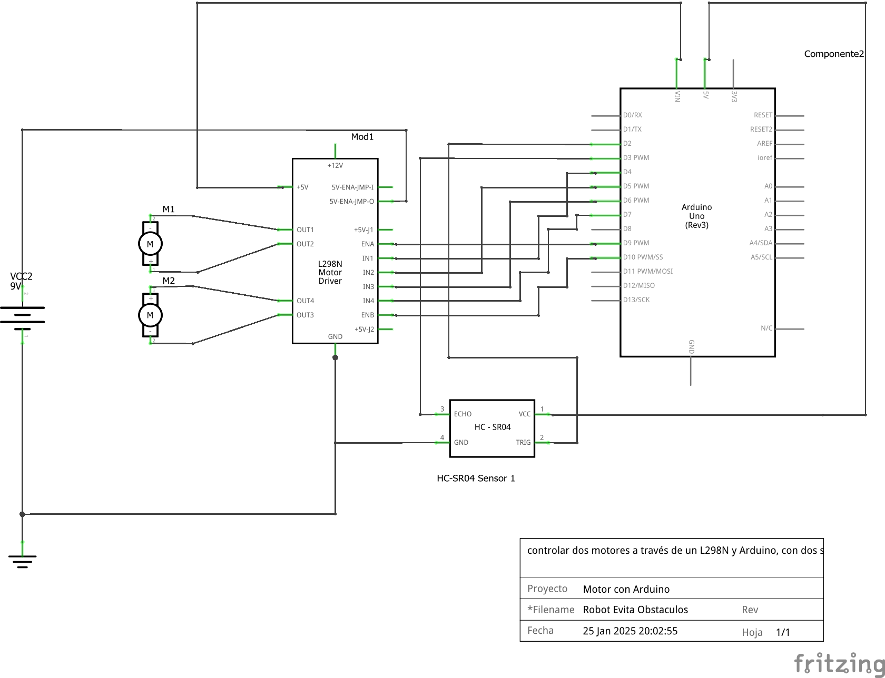

# Robot Evita Obstáculos

Este proyecto implementa un robot que utiliza un sensor de ultrasonidos HC-SR04 para detectar obstáculos y modificar su movimiento. El robot avanza normalmente, pero cuando detecta un obstáculo a menos de 20 cm, reduce su velocidad y gira aleatoriamente a la izquierda o derecha para evitarlo.

## Características
- Detección de obstáculos con el sensor HC-SR04.
- Control de velocidad mediante PWM.
- Movimiento aleatorio al detectar un obstáculo (giro a la izquierda o derecha).
- Retroceso antes de girar para evitar colisiones.

## Requisitos de Hardware
- Microcontrolador (Arduino Uno, Nano, etc.).
- Sensor de ultrasonidos HC-SR04.
- Puente H (L298N o similar).
- Motores DC con reductora (motoreductores).
- Batería (por ejemplo, 9V o pack de baterías).
- Cables y conectores.

## Diagrama de Conexiones


## Instalación
1. Clona este repositorio:
   ```bash
   git clone https://github.com/draexx/Robot-Evita-Obstaculos.git

2. Abre el archivo RobotEvitaObstaculos.ino en el IDE de Arduino.

3. Conecta tu Arduino al ordenador.

4. Selecciona la placa y el puerto correctos en el IDE de Arduino.

5. Sube el código a tu Arduino.

## Uso
1. Alimenta el robot con la batería.

2. El robot comenzará a avanzar.

3. Cuando detecte un obstáculo a menos de 20 cm, reducirá su velocidad y girará aleatoriamente para evitarlo.

## Licencia
Este proyecto está bajo la Licencia MIT - ver el archivo [LICENSE](LICENSE) para más detalles.

## Autor
[Pedro Carranza](https://github.com/draexx)

## Contribuciones
¡Las contribuciones son bienvenidas! Si encuentras algún problema o tienes una mejora, abre un issue o envía un pull request.